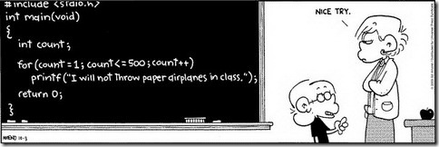

```{r setup, include=FALSE}
knitr::opts_chunk$set(echo = FALSE)
```

##
<center>
```{r, out.width = "340px"}

```
</center>

##
<center>
```{r, out.width = "340px"}

```
</center>

##
<center>
```{r, out.width = "340px"}

```
</center>

## Introduction

### What is R?

R is an elegant, powerful, and comprehensive scripting interpreted language and environment for statistical computing, data manipulation, analysis and visualizations.

### A note on history
Essentially R is a dialect of S language. S was developed by John Chambers in 1975–1976, as Fortran library. The third version of S (become a functional, object-based language) together with the book The New S Language (Blue Book) was introduced in 1988 and implemented already in C. The current fourth version provides advanced (formal) object-oriented features. R was created by <b>R</b>oss Ihaka and <b>R</b>obert Gentleman at the University of Auckland, New Zealand as a free implementation of S.

## Why (we all love) R?

Advantages:

- Free (freedom 0 - 3: run, change/adapt/edit, distribute and improve)
- Cross-platform
- Low barrier to entry
- Really beautiful plots and graphics
- Plenty of packages (9000+ CRAN + bioconductor)

## Why (we all love) R?

Advantages (more?):

- Amazing community (R-help and R-devel mailing lists, Stack Overflow)
- Advanced and state-of-the-art tools (packages) not available in other languages
- Enormous number of references (use R! Springer series, Hadley Wickham books, etc.)

## Why sometimes you may use another more appropriate tool?

Drawbacks:

- Relatively slow (interpreted vs. compiled)
- Store all objects in memory (RAM, operation storage device) instead of storage (HDD/SDD, permanent storage device) (ff package)
- Not so nice 3D graphics
- There is (ABSOLUTELY) no warranty and guaranty (not all packages are accredited)

## Integrated Development Environments (IDEs) and text editors

- Old good "pure" R 
- **RStudio (highly recommended "by-default" IDE)**
- Eclipse (StatET)
- Emacs
- Command line 
- Many many more (check in wiki)

## How do I start?

- How do I install R and **RStudio**?
- What is the console and what is the script (source)?
- How to execute a code?
- How do I use R as a calculator?

<center></center>

## Couple of notes about syntax

- Historically in R one uses `<-` operator to assign instead of `=`. Both are valid, but the former one (`<-`) is preferred 
- A syntactically valid name consists of letters, numbers, dots and underlines characters and starts with a letter or a dot not followed by a number
- R is case-sensitive, meaning that `variable` and `Variable` are two different names
- To print a content of an object, either simply execute the name of the object or `print(name_of_object)`

## Couple of notes about syntax

- The symbol `#` is used for commenting (the code after this sign in the line will be ignored by the interpreter)
- Each statement should be written on the next line, unless it is separated by `;`
- To call help for a function type the question mark in front of the name of the function without parenthesis
- Code auto-completion (RStudio, Press `Tab`)

## Outline

- Data structures
- Subsetting
- Control structures
- (User-defined) functions
- Statistical functions
- Plotting
- Importing data
- Packages

# Data structures

## Data structures

Dimensionality| Homogeneous |Heterogeneous|
--------------|-------------|-------------|
      1d      |Atomic vector|    List     |
      2d      |    Matrix   | Data frame  |
      nd      |    Array    |             |
      

## Atomic vectors

The simplest object in R is an atomic vector, which is defined as a sequence of data elements of the <b>same basic type</b>. Elements could be also called members, components, or cells.

There are six basic types:

- logical (short and long forms are: `TRUE`/`FALSE`, `T`/`F`)
- integer (`-2147483647` to `2147483647`) (use suffix L to indicate integer, e.g. `3L`)
- double (or numeric) (range of absolute values from `2e-308` to `2e+308`, ±Inf, NaN, has double precision)
- character (`"some character vector"`, both single quotes `'` and double quotes `"` are used)
- ~~complex~~ (`2 + 3i`)
- ~~raw~~

## Atomic vectors

<b>Very important note:</b>

There is no such thing in R as a single number or a scalar. Instead, it is represented as a vector of length 1. I.e. single numbers (`4.2`) and single strings (`"four point two"`) are still vectors of length 1.

A vector can have length 0 (which in some cases is very useful).

```{r, echo = TRUE}
x <- 3
is.vector(x)
length(x)
```


## Atomic vectors

Atomic vectors are typically created with the function `c()`, where `c` stands for combine:

```{r, echo = TRUE}
# logical 
logical_vector <- c(T, T, FALSE, F, T, FALSE)
# integer 
integer_vector <- c(1L, 2L, 4L)
# double
double_vector <- c(5.5, 3.1, 2.0)
# character
chraracter_vector <- c("these are", "some strings")
```

## Atomic vectors

Functions `typeof()` and `class()` determine the type of a vector:

```{r, echo = TRUE}
string <- c("I love", "Xmas")
typeof(string); class(string)
x <- c(1.1, 2)
typeof(x); class(x)
```

## Atomic vectors

Function `is.logical()` (`is.numeric()`, `is.character()`) returns `TRUE`, if an object is of class logical (numeric, character):

```{r, echo = TRUE}
is.numeric(c(1, 2, 3))
is.logical(c("a", "b"))
```


## Atomic vectors

<b> Missing values </b> are marked by `NA`:

```{r, echo = TRUE} 
character_vector <- c("actuarial", NA, "science")
print(character_vector)

numeric_vector <- c(1, 2, NA, 4)
print(numeric_vector)

logical_vector <- c(T, F, NA, T)
print(logical_vector)
```

## Atomic vectors

There are also infinity "number" and `NaN` (not a number, or simply undefined) for numeric vectors:
```{r, echo = TRUE} 
1 / 0
-1 / 0
0 / 0
```

## Exrercises 1

- Create a character vector `names` that contains five elements `Kate`, `Jack`, `Bob`, `Ana`, and `Will`
- Create a vector `grades` of values `1.5`, `4`, `5`, missing value and `5`. Is it an integer vector?
- Create a vector `passed` with elements `FALSE`, `TRUE`, `TRUE`, missing value and `TRUE`. How many elements the vector has?

## Atomic vectors

Elements of vectors can have names:

```{r, echo = TRUE}
grades <- c(Jack = 5, Stacy = 2.5, John = 5)
grades
offices <- c(3, 4)
names(offices) <- c("EXT105", "EXT106")
offices
```

## Atomic vectors

Useful functions for numeric vectors: 

```{r, echo = TRUE}
x <- c(1, 5, 3, 1)
sum(x)
prod(x)
mean(x)
```

## Atomic vectors

Useful functions for numeric vectors: 

```{r, echo = TRUE}
x <- c(1, 5, 3, 1)
min(x)
max(x)
```

## Atomic vectors

Useful functions for numeric vectors: 

```{r, echo = TRUE}
x <- c(1, 5, 3, 1)
exp(x)
log(x)
sqrt(x)
```

## Atomic vectors

All mathematical operations for vectors are element-wise, i.e.: 

```{r, echo = TRUE}
x <- c(1, 5, 3, 1)
y <- c(5, 4, 3, 2)
x + y
x - y
x * y
```

## Atomic vectors

<b>Extremely useful</b> function `rep` (replicate) for creating numeric vectors:

```{r, echo = TRUE}
rep(x = 7, times = 3)
rep(x = c(1, 2), each = 4)
rep(x = c(1, 2), times = 3)
```

## Atomic vectors

<b>Extremely useful</b> function `seq` (sequence) for creating numeric vectors:

```{r, echo = TRUE}
seq(from = 1, to = 10, by = 2)
seq(from = 1, to = 10, length.out = 4)
1:10
```

## Exrercises 2

Using `rep()` and `seq()` functions, create the following vectors:

- `1, 2, 3, 4, 5, 6`
- `21, 21, 21, 17, 17, 17, 32, 32, 32`
- `21, 17, 17, 32, 32, 32`
- `1, 2, 2, 3, 3, 3, 4, 4, 4, 4`

## Atomic vectors

What happens if you use the function `c()` to combine elements of different types?

```{r, echo = TRUE}
c(1, "a", "b", 5)
```

All elements of an atomic vector must be of the same type, therefore combining  different types will lead to an <b>(implicit) coercion</b> and will return a vector of the most flexible type (logical < integer < double < character).

<b>CAUTION:</b> Implicit coercion is the source of many bugs. Must be used with a care. However, most mathematical functions will coerce automatically. 

## Atomic vectors

With explicit coercion the developer explicitly changes one data type to the other:

```{r, echo = TRUE}
as.numeric(c('1', '2', 'a'))
as.character(c(1, 2, 3))
as.logical(c(1, 0, -2))
```

## Factors

Factor is a vector that can contain only predefined values:

```{r, echo = TRUE}
gender <- factor(c("m", "f", "m", "f", "f"))
gender
```

## Lists

Lists are also sequence of data elements, but allow for different types of elements, including lists (nested lists). In order to construct a list one uses `list()` instead of `c()`:

```{r, echo = TRUE}
my_list <- list(TRUE, 3.14, 'string', 3:10)
print(my_list)
```

## Lists

Lists also can be named:
```{r, echo = TRUE}
claim <- list(size = 25, is_paid = FALSE, contract = "ltc")
print(claim)
```


## Matrices

In R the mathematical concept of matrices is implemented in a separate data structure: matrix. Essentially a matrix is simply an atomic vector with `dim()` attribute. Matrix can be easily created by the function `matrix()`

```{r, echo = TRUE}
A <- matrix(data = 1:6, nrow = 2, ncol = 3)
A
dim(A)
```

## Matrices

There is a useful function for creating an identity matrix in a simple way, namely `diag()`:

```{r ten_t, echo = TRUE}
I <- diag(4)
I
```

## Matrices

Matrices are not necessarily numeric. They can contain any type. However, elements must be of the same type:

```{r sixteen, echo = TRUE}
logical_matrix <- matrix(data = c(T, T, F, F), nrow = 2, ncol = 2)
logical_matrix
character_matrix <- matrix(data = rep("a", 4), nrow = 2, ncol = 2)
character_matrix
```


## Matrices

R provides a full set of functions, which are used with matrices. For instance, to get or set the size of the matrix `ncol()` and `nrow()` are used:

```{r eleven, echo = TRUE}
A <- matrix(data = 1:6, nrow = 2, ncol = 3)
nrow(A)
ncol(A)
```

## Matrices

One can also set names for columns and rows:

```{r twelw, echo = TRUE}
A <- matrix(data = 1:6, nrow = 2, ncol = 3)
rownames(A) <- c("a", "b")
colnames(A) <- c("col1", "col2", "col3")
A
rownames(A)
```

## Matrices

Transpose the matrix by using the function `t()`...

```{r twelve, echo = TRUE}
A <- matrix(data = 1:6, nrow = 2, ncol = 3)
A
t(A)
```


## Matrices

Inverse a non-singular square matrix by the function `solve()`...

```{r thirteen, echo = TRUE}
A <- matrix(data = 1:4, nrow = 2, ncol = 2)
solve(A)
```

There are also functions for various decomposition:

- `chol()` for Choleski decomposition
- `eigen()` for eigenvalues and eigenvectors, etc.

## Matrices

<b>Very important note:</b>
All mathematical operators `+`, `-` and very importantly `*` works element-wise for matrices:

```{r fourteen, echo = TRUE}
A <- matrix(data = 1:4, nrow = 2, ncol = 2)
B <- matrix(data = 5:8, nrow = 2, ncol = 2)
A; B; A + B
```

## Matrices

<b>Very important note:</b>
For mathematical matrices product/multiplication use `%*%`:

```{r fifteen, echo = TRUE}
A <- matrix(data = 1:4, nrow = 2, ncol = 2)
B <- matrix(data = 5:8, nrow = 2, ncol = 2)
A * B # element-wise multiplication
A %*% B # mathematical multiplication
```

## Matrices

Also you can combine (or bind) matrices column-wise... 

```{r twenty, echo = TRUE}
A <- matrix(data = 1:4, nrow = 2, ncol = 2)
B <- matrix(data = 5:8, nrow = 2, ncol = 2)
cbind(A, B)
```

## Matrices
...or row-wise:

```{r, echo = TRUE}
A <- matrix(data = 1:4, nrow = 2, ncol = 2)
B <- matrix(data = 5:8, nrow = 2, ncol = 2)
rbind(A, B)
```


## Exercises 3

- Create the following matrix:

$$\mathbf{A} = \left[\begin{array}
{rrr}
1 & 1 & 3 \\
5 & 2 & 6 \\
-2 & -1 & -3
\end{array}\right]
$$

- Make sure that:

$$\mathbf{A}^3 = \left[\begin{array}
{rrr}
0 & 0 & 0 \\
0 & 0 & 0 \\
0 & 0 & 0
\end{array}\right]
$$

## Data frames

Matrices are very useful data structures as a mathematical concept, but what if we need to store different types of variables? For instance, we have three students Eric, Jane, and Kate, with their corresponding CTA's final grades. On top of that, we want to store wether he or she passed or not.

## Data frames

Problem: how to represent this piece of data?

<center>
```{r, out.width = "600px"}

```
</center>

## Data frames

One can store this data in separate vectors...

```{r, echo = TRUE}
names = c('Eric', 'Jane', 'Kate')
grades = c(6, 2, 5)
passed = c(T, F, T)
```

which is not very convenient. 

## Data frames

For this purpose in R <b>data frames</b> are used. Data frames are two dimensional objects, for which it is allowed to have different types of columns:

```{r, echo = TRUE}
df <- data.frame(Name = c('Eric', 'Jane', 'Kate'), Grade = c(6, 2, 5),
                 Passed = c(T, F, T))
df
```

## Data frames

<b>Very roughly</b> data frames are matrices with different columns' data types.

<center>

</center>


## Data frames

Many functions that we have seen for matrices can be applied also to data frames:

```{r eighteen, echo = TRUE}
df <- data.frame(Name = c('Eric', 'Jane', 'Kate'), Grade = c(6, 2, 5),
                 Passed = c(T, F, T))
nrow(df); ncol(df)
colnames(df); rownames(df)
```


## Data frames

You can combine data frames using `cbind()` and `rbind()`:

```{r, echo = TRUE}
df1 <- data.frame(Name = "Eric", Grade = 6, Passed = TRUE)
df2 <- data.frame(Name = "Jane", Grade = 2, Passed = FALSE)
rbind(df1, df2)
df3 <- data.frame(Name = c("Eric", "Jane"), Grade = c(6, 2))
df4 <- data.frame(Passed = c(TRUE, FALSE))
cbind(df3, df4)
```

## Data structures

Further reading:

- Attributes 
- Arrays

# Subsetting

## Subsetting

Also, in R, subsetting is one of the main advantages. The art of subsetting will help you do complex things much faster and in a more efficient way.

<b>Note:</b> In R indexing starts from 1, <b>NOT</b> from 0.

<center>

</center>

## Subsetting atomic vectors

```{r, echo = TRUE}
x <- c(2.1, 4.2, 3.3, 5.4)
x[2]
```

<center>
```{r, out.width = "340px"}
knitr::include_graphics("img/tired.gif")
```
</center>

## Subsetting atomic vectors

<b>Positive integers</b> return elements at the specified positions: 
```{r, echo = TRUE}
x <- c(2.1, 4.2, 3.3, 5.4)
x[c(3, 1)]
# Duplicated indices yield duplicated values
x[c(1, 1)]
# Real numbers are silently truncated to integers
x[c(2.1, 2.9)]
```


## Subsetting atomic vectors

<b>Negative integers</b> omit elements at the specified positions: 
```{r, echo = TRUE}
x <- c(2.1, 4.2, 3.3, 5.4)
x[c(-3, -1)]
```
You can’t mix positive and negative integers in a single subset. 


## Subsetting atomic vectors

<b>Logical vectors</b> select elements where the corresponding logical value is `TRUE`. This is probably the most useful type of subsetting because you write the expression that creates the logical vector... 
```{r, echo = TRUE}
x <- c(2.1, 4.2, 3.3, 5.4)
indices <- c(TRUE, TRUE, FALSE, FALSE)
x[indices]
```

## Subsetting atomic vectors

... and this allows for conditional subsetting!

```{r, echo = TRUE}
x <- c(2.1, 4.2, 3.3, 5.4)
x[x > 3]
```
<center>

</center>

## Subsetting atomic vectors

Magic explained:

```{r, echo = TRUE}
x <- c(2.1, 4.2, 3.3, 5.4)
x > 3
indices <- x > 3
x[indices]
```

## Subsetting atomic vectors

<b>Nothing</b> (blank) returns the original vector, and <b>zero</b> returns a zero-length vector.
```{r, echo = TRUE}
x <- c(2.1, 4.2, 3.3, 5.4)
x[]
x[0]
```

## Exercises 4

- Create a vector `claims` of values: `106, 52, 35, 84, 90, 21`
- Print the fifth, third and fourth claim
- Print all claims except the last one
- Print only claims strictly greater than 52

## Subsetting lists

For lists subsetting is a bit more complicated. R has three kind of operators to subset:

- `[` returns <b>a list</b> containing only the specified elements
- `[[` returns an element at the specified position (similar to subsetting for atomic vectors)
- `$` returns an element by its name


## Subsetting lists

`[` versus `[[`:

```{r, echo=TRUE}
my_list <- list("Jane", 22, F)
my_list[1:2]
my_list[[1]]
```

Note: Inside `[[` one can specify only one integer number. 

## Subsetting lists

Subsetting by name of the element:

```{r, echo=TRUE}
my_list <- list(name = "Jane", age = 22, is_married = F)
my_list$name
my_list$age
```

## Subsetting matrices

The most common way of subsetting matrices (2d) is a simple generalization of 1d subsetting: you supply a 1d index for each dimension, separated by a comma.

```{r, echo=TRUE}
the_matrix <- matrix(1:6, nrow = 2, ncol = 3)
the_matrix
the_matrix[1, 2]
```

## Subsetting matrices

Blank subsetting is now useful because it lets you keep all rows or all columns.

```{r, echo=TRUE}
the_matrix <- matrix(1:6, nrow = 2, ncol = 3)
the_matrix[1, ]
the_matrix[, c(2, 3)]
```

## Subsetting matrices

Tiny but very nice trick:

```{r, echo=TRUE}
the_matrix <- matrix(1:9, nrow = 3, ncol = 3)
the_matrix[the_matrix[, 2] > 4, ]
```

<center>

</center>

## Subsetting data frames

Subsetting data frames is very similar to subsetting matrices:

```{r, echo=TRUE}
df <- data.frame(Name = c('Eric', 'Jane', 'Kate'), Grade = c(6, 2, 5),
                 Passed = c(T, F, T))
df[2, 1]
df[1, ]
df[3, c(T, F, F)]
```

## Subsetting data frames

However, as long as under the hood, data frames are build on top of lists, one can use also some tricks from lists' subsetting...

```{r, echo=TRUE}
df <- data.frame(Name = c('Eric', 'Jane', 'Kate'), Grade = c(6, 2, 5),
                 Passed = c(T, F, T))
df[, 2] # is the same as...
df$Grade
```

## Subsetting data frames

... which allows us to do pretty amazing things like the following:

```{r, echo=TRUE}
df <- data.frame(Name = c('Eric', 'Jane', 'Kate'), Grade = c(6, 2, 5),
                 Passed = c(T, F, T))
df[df$Grade == 6, 1]
df[df$Passed, ]

```

## Subsetting and assignment

All subsetting operators can be combined with assignment to modify selected values of the input vector.

```{r, echo = TRUE}
x <- 1:5
x[c(1, 2)] <- 2:3
x

df <- data.frame(Name = c('Eric', 'Jane', 'Kate'), Grade = c(6, 2, 5),
                 Passed = c(T, F, T))
df[1, 2] <- 5.5
df
```

## Subsetting 

Further reading:

- Subsetting by names
- Subsetting factors
- `which()`
- `%in%`
- Ordering and sorting

# Control structures

## Control structures

In programming languages one needs to control the flow of the execution depending on run-time conditions. R contains the classical control structures that you would expect:

- `if/else`
- `switch`
- `for`
- `while` (really rarely used)
- ~~`repeat`~~ (extremely dangerous)
- Additional `next`, `break` and `return`. 

## Operators

Operators `==`, `!=`, `>`, `<`, `<=`, `>=`
```{r, echo=TRUE}
x <- 3
y <- "s"

x == 5
x != 4

y == "s"
```

## Boolean algebra

- `!` indicates logical negation (NOT)
- Logical AND: `&` (element-wise)  and `&&` (only the first element, short circuiting)
- Logical OR: `|` (element-wise)  and `||` (only the first element, short circuiting)

## Boolean algebra

```{r, echo=TRUE}
!TRUE
vec1 <- c(T, T, F, F) 
vec2 <- c(T, F, T, F )
vec1 & vec2 # logical AND (short version, elementwise)
vec1 | vec2 # logical OR (short version, elementwise)
```

## Boolean algebra
```{r, echo=TRUE}
vec1 <- c(T, T, F, F) 
vec2 <- c(T, F, T, F )

vec1 && vec2 # logical AND (long version, only the first element)
vec1 || vec2 # logical OR (long version, only the first element)
```

## Boolean algebra

Very useful functions: 

- `all()` checks if ALL elements of its argument are true
- `any()` checks a logical condition against all elements of its argument and returns `TRUE` if it is satisfied by at least one element

```{r, echo=TRUE}
x <- c(TRUE, FALSE, TRUE, TRUE)
all(x)
any(x)
```

## Control structure `if/else`

`if/else` implements conditional execution. Depending on a given (logical) "condition", one and only one
statement will be executed. Here is the syntax of this control structure:
```{r, echo = TRUE}
# if(condition) {
#       expression1
# } else {
#       expression2
# }
# expression3
```
The machine will check the value of the condition. If it is `TRUE`, then <b>ONLY</b>
`expression1` will be executed and the program will continue after the last bracket, i.e. `expression3`. Otherwise, `expression2` will be executed.

## Control structure `if/else`

```{r, echo=TRUE}
x <- 4 
if(x > 3) {
    y <- "x is greater then 3"
} else {
    y <- "x is less or equal to 3"
}
y
```

## Control structure `if/else`

The "else" case is not required:
```{r, echo=TRUE}
# if(condition) {
#       expression1
# }
```
In this case statement1 will be executed if and only if `condition == TRUE`.
```{r, echo=TRUE}
x <- 4 
if(x == 4) {
    print("x equals to 4")
}
```

## Control structure `if/else`
<b>Note:</b> conditions are evaluated from left to right.

```{r, echo=TRUE}
x <- 4
y <- 7
if(x == 4 && y < 10) {
    print("x equals to 4 AND y is less than 10")
}
```

## Control structure `if/else`

For a one line expression, one can avoid curly braces:

```{r, echo=TRUE}
x <- 4 
if(x == 4) print("x equals to 4")
```

There is also a special function, which should be used with a care (returns the object of the same shape as the condition).
```{r, echo=TRUE}
x <- 3.5
y <- ifelse(test = x > 3, yes = 4, no = 3)
y
```

## Control structure `for`

`for` loop is the most used loop in R, and has the following syntax:

```{r, echo = TRUE}
# for(variable in sequence) {
#     expression
# }
```

`for` loop executes `expression` the same number of times (iterations) as a length of `sequence`. At the same time iterator `variable` is assigned to successive values from this `sequence`.

<center>

</center>

## Control structure `for`

```{r, echo = TRUE}
colors_set <- c("red", "black", "green", "yellow")
for(color in colors_set) {
    print(color)
}
numbers <- c(4, 5, 1)
for(num in numbers) {
    print(num)
}
```

## Control structure `for`

Nevertheless, it is possible to iterate over indices:

```{r, echo = TRUE}
colors_set <- c("red", "black", "green", "yellow")
for(i in 1:length(colors_set)) {
    print(colors_set[i])
}
```

## Control structure `for`

`for` loop also works nicely with lists:

```{r, echo = TRUE}
data <- list("string", 2:3, TRUE)
for(element in data) {
    print(element)
}
```

## Control structure `for`

All loops in R can be nested:
```{r, echo = TRUE}
matrix_1999 <- matrix(data = 1:4, nrow = 2, ncol = 2, byrow = TRUE)

for(i in 1:nrow(matrix_1999)) {
    for(j in 1:ncol(matrix_1999)) {
        print(matrix_1999[i,j])
    }
}
```

## Control structure `while`

`while` loop will execute the block of code <b>while</b> the condition inside brackets is TRUE. In other words, until the condition after the keyword "while" is FALSE, the while loop will keep iterating.
```{r, echo = TRUE}
# while(condition) {
#     expression
# }
```

<b>Caution:</b> Be careful with an (endless) infinite loop.

## Control structure `while`

```{r, echo = TRUE}
i <- 1
while (i < 5) {
    print(i)
    i <- i + 1
}
```

## Control structure

Further readings:

- `next` and `break`
- `else if`
- `switch`
- *-`apply` family of functions*

## Exercises 5

- Initialize a list with following elements: `xmas__, 623, 142, 4072322, TRUE`
- Add two and take a square root of each numeric element of this list

Hint: use `for` loop to go over each element and use `if` statement to do math with only numeric elements

# (User-defined) Functions

## (User-defined) Functions

R is a functional language, no wonder that functions are a fundamental building block of R.

Functions are mathematical concepts that receive an input (or not) and return an output (or not) after some computation. Functions are used to avoid repetition of the code.

Functions have the following syntax in R:

```{r, echo=TRUE}
# function_name <- function(arg1, arg2) {
#   body of the function
# }
```

## Functions

Functions return the value of the last expression. You may also specify the structure `return()` which will return the value inside the brackets and skip everything after.

```{r, echo=TRUE}
f1 <- function(x) {
    x ^ 2
}
f2 <- function(x) {
    return(x ^ 2)
    x ^ 3
}
f1(3)
f2(3)
```

## Functions 

By default, R function arguments are lazy — they’re only evaluated if they’re actually used: 

```{r, echo=TRUE}
f <- function(x, y) {
    print(x)
}
f("Print me")

```

<center>

</center>

## Functions

Functions can have default arguments:

```{r, echo=TRUE}
f <- function(x, y = 2) {
    x ^ y
}
f(3, 4)
f(3)
```

## Functions

Functions can be nested in R:

```{r, echo=TRUE}
f <- function(x) {
    g <- function(y) {
        y + 10
    }
    g(x) * 2
}
f(3)
```

## Functions

There are two ways to pass arguments to a function: (1) by name and (2) by
position. A machine will follow exactly this order. 

The function `qnorm()` returns a quantile of a normal distribution, and has the following arguments:

- `p`: probability
- `mean`: expected value, by default is `0`
- `sd`:  standard deviation, by default is `1`

## Functions
```{r, echo = TRUE}
qnorm(p = 0.95)
qnorm(p = 0.95, mean = 2, sd = 1)
qnorm(sd = 1, p = 0.95, mean = 2)
qnorm(0.95, 2, 1)
```

## Functions

Further reading:

- Partial matching of arguments
- `...` argument
- Scoping rules
- Lazy evaluation
- Functions' environments 
- and many many more topics about functions

## Exercise 6

Write a function of two arguments. The first argument is a numeric vector `x` of arbitrary size, while the second one is a numeric vector `p` of length one with default value `1`. The function should return the following: 

<center>
$$\frac{1}{n}(x_1^p + ... + x_n^p)
$$
</center>

# Statistical functions

## (Basic) statistical functions

R provides a rich set of statistical functions. Density, cumulative distribution function, quantile function and random variable generation are available for many standard probability distributions.

- `dnorm(x, mean = 0, sd = 1, log = FALSE)`
- `pnorm(q, mean = 0, sd = 1, lower.tail = TRUE, log.p = FALSE)`
- `qnorm(p, mean = 0, sd = 1, lower.tail = TRUE, log.p = FALSE)`
- `rnorm(n, mean = 0, sd = 1)`

<center>

</center>

## Statistical functions

The functions for the density/mass function, cumulative distribution function, quantile function and random variable generation are named in the form `dxxx`, `pxxx`, `qxxx` and `rxxx` respectively.

Supported distributions: 

- Binomial (including Bernoulli): see `dbinom`
- Exponential: see `dexp`
- Gamma: see `dgamma`
- Log-normal: see `dlnorm`
- Normal: see `dnorm`
- Student's t: see `dt`
- Many many more

## Statistical functions

```{r, echo = TRUE}
x <- rnorm(100)
mean(x) # sample mean
var(x) # sample variance
sd(x) # sample standard deviation
```

## Statistical functions

```{r, echo = TRUE}
x <- rexp(100)
t.test(x)
# many many other tests
```

# Plots

## Plots

One of the best parts of R is its plotting capabilities. There are three "official" plotting systems in R: 

- Base graphics
- Grid graphics
- lattice

There is also a <b>very famous</b> package `ggplot2` by Hadley Wickham, which itself might be the topic for 3 hours lecture. Due to the lack of time we will only cover the base system.

<center>

</center>

## Box plot

<center>

<!center>

## Box plot

```{r, echo = TRUE}
x <- rnorm(100); y <- rexp(100); z <- rlnorm(100)
boxplot(x, y, z)
```

## Plots: histogram

```{r, echo = TRUE}
x <- rnorm(1000)
hist(x)
```

## Plots: scatter plot

```{r, echo = TRUE}
x <- rnorm(1000); y <- rnorm(1000)
plot(x, y)
```

## Plots: pie chart

```{r, echo = TRUE}
x <- c(70, 30)
pie(x)
```

## Exercise 7

Generate 1000 random numbers drawn from a normal distribution with mean 4 and standard deviation 5. Plot its histogram. 

# Importing data 

## Importing data 

Typically data is stored externally, and before starting analyzing the data one needs to import it to R from various different sources.

R allows to "read" directly from SPSS, SAS, Excel, Stata etc. (using external packages in most cases)


## Importing data

Traditionally data for R is stored in CSV (comma separated values) files, and base R can easily read from such files.

```{r, echo = TRUE}
# data <- read.csv("/Users/irudnyts/Desktop/mtcars.csv")
# head(data)
```

# Packages

## Packages

Packages are the fundamental units of reproducible R code. They include reusable R functions, the documentation that describes how to use them, and sample data.

It is very easy to install a package, as well as to load it.

```{r, echo = TRUE}
# install.package("ggplot2")

library(ggplot2)
```

# Recommended references 

## Recommended references 

From my own experience:

- DataCamp(.com)
- Advanced R by Hadley Wickham
- R programming at Coursera
- The Art of R Programming by Norman Matloff

## Thank you! Have a nice Christmas break and good luck for finals!

<center>

</center>